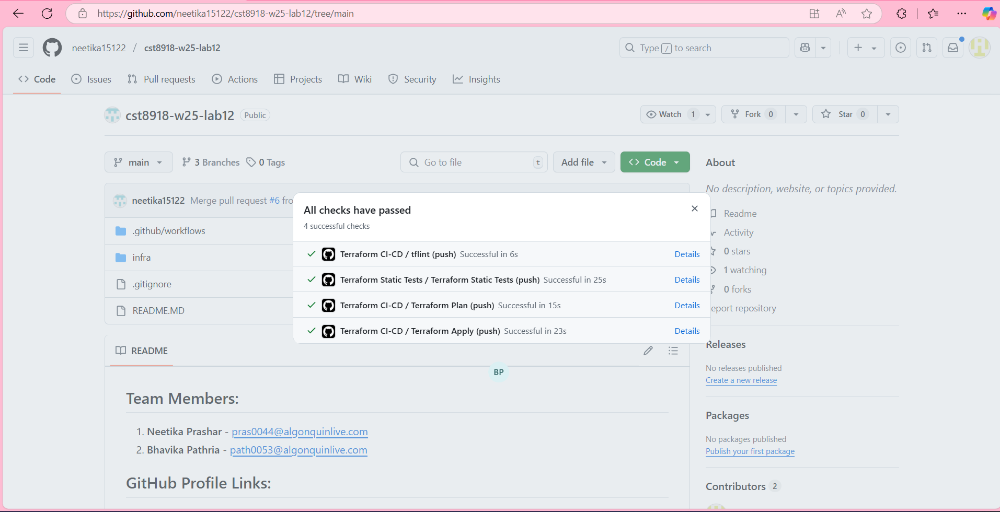
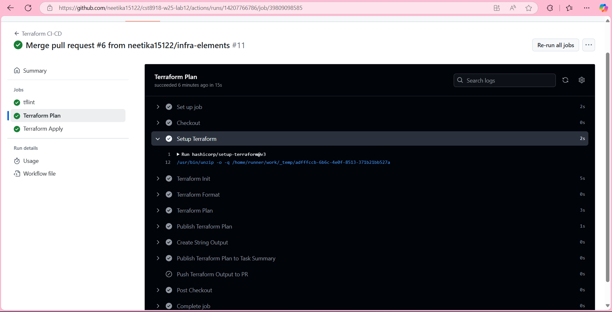

## Lab 12: Terraform CI/CD on Azure with GitHub Actions:
# Team Members:
1. **Neetika Prashar** - [pras0044@algonquinlive.com](mailto:pras0044@algonquinlive.com)  
2. **Bhavika Pathria** - [path0053@algonquinlive.com](mailto:path0053@algonquinlive.com)  

## GitHub Profile Links:
1. **Neetika Prashar** - [GitHub Profile](https://github.com/neetika15122)  
2. **Bhavika Pathria** - [GitHub Profile](https://github.com/BhavikaPathria-02)  

## 1. GitHub Repository Initial Settings

One lab partner, create a new repository on GitHub called `cst8918-w25-lab12`. Initialize the repository with a README file and a `.gitignore` file for Terraform.

> **TIP:**
> Copy the `.gitignore` file from an earlier assignment.

### Add a Collaborator

Add your lab partner as a collaborator to the repository. This will allow them to push changes, and create or approve pull requests in the repository.

Near the top of your `README.md`, note the names and college usernames of your team members, and link to their GitHub profiles.

### Branch Protection Rules

To protect the `main` branch, create a branch protection rule set that:

- Prevents direct pushes to the branch. This will require all changes to be made through a pull request.
- Restricts deletion of the branch.
- Requires at least one approving review before merging.

Later you should add more rules to this set, but for now, these are the minimum requirements.

> **TIP:**
> See these [instructions from the GitHub Docs](https://docs.github.com/en/github/administering-a-repository/defining-the-mergeability-of-pull-requests/about-protected-branches).

### GitHub Environment

The GitHub Actions workflows that you will create utilize GitHub Environments and Secrets to store the Azure identity information and set up an approval process for deployments. In the `Settings > Environments` tab of your repository, create an environment named `production`.

> **TIP:**
> See these [instructions from the GitHub Docs](https://docs.github.com/actions/deployment/targeting-different-environments/using-environments-for-deployment#creating-an-environment).

#### Deployment Protection Rules

On a bigger team, you may want to require approval before deploying to production. Or, you may want to restrict which branches can deploy to production. These rules can be set in the `Settings > Environments` tab of your repository.

For this lab, set the `production` environment to only deploy from the `main` branch and require approval before deploying. Set both team members as the only people who can approve the deployment and check the box to **Prevent self-review**.

> **TIP:**
> See these [instructions from the GitHub Docs](https://docs.github.com/en/actions/deployment/targeting-different-environments/using-environments-for-deployment#environment-protection-rules).


## 1. GitHub Repository Initial Settings

One lab partner, create a new repository on GitHub called `cst8918-w25-lab12`. Initialize the repository with a README file and a `.gitignore` file for Terraform.

> **TIP:**
> Copy the `.gitignore` file from an earlier assignment.

### Add a Collaborator

Add your lab partner as a collaborator to the repository. This will allow them to push changes, and create or approve pull requests in the repository.

Near the top of your `README.md`, note the names and college usernames of your team members, and link to their GitHub profiles.

### Branch Protection Rules

To protect the `main` branch, create a branch protection rule set that:

- Prevents direct pushes to the branch. This will require all changes to be made through a pull request.
- Restricts deletion of the branch.
- Requires at least one approving review before merging.

Later you should add more rules to this set, but for now, these are the minimum requirements.

> **TIP:**
> See these [instructions from the GitHub Docs](https://docs.github.com/en/github/administering-a-repository/defining-the-mergeability-of-pull-requests/about-protected-branches).

### GitHub Environment

The GitHub Actions workflows that you will create utilize GitHub Environments and Secrets to store the Azure identity information and set up an approval process for deployments. In the `Settings > Environments` tab of your repository, create an environment named `production`.

> **TIP:**
> See these [instructions from the GitHub Docs](https://docs.github.com/actions/deployment/targeting-different-environments/using-environments-for-deployment#creating-an-environment).

#### Deployment Protection Rules

On a bigger team, you may want to require approval before deploying to production. Or, you may want to restrict which branches can deploy to production. These rules can be set in the `Settings > Environments` tab of your repository.

For this lab, set the `production` environment to only deploy from the `main` branch and require approval before deploying. Set both team members as the only people who can approve the deployment and check the box to **Prevent self-review**.

> **TIP:**
> See these [instructions from the GitHub Docs](https://docs.github.com/en/actions/deployment/targeting-different-environments/using-environments-for-deployment#environment-protection-rules).

---

## 2. Create Azure Infrastructure to Store Terraform State

As you will be using GitHub Actions to run Terraform, you will need to store the Terraform state file in a remote location. In this lab, you will use an Azure Storage Account to store the Terraform state file.

In last week's lab, you created the storage account and container manually using AZ CLI. This week, you will create them using a separate Terraform module. All of the Terraform configuration for the storage account and container should be created in the `infra/tf-backend` folder. This will keep the Terraform configuration for the storage account and container separate from the configuration for the AKS cluster.

> **WARNING:**
> The `tf-backend` and `tf-app` folders are separate Terraform configurations. Commands like `terraform init`, `terraform plan`, and `terraform apply` should be run in each folder separately.

The reason for separating the two configurations is because the storage account and container are used to store the Terraform state file for the app infrastructure configuration. If the backend infrastructure and app infrastructure are in the same configuration, you will run into a chicken-and-egg problem where the Terraform state file is stored in the storage account that is being created by Terraform.

### Create the Backend Terraform Configuration

This will be a simple configuration with only the necessary resources to store the Terraform state file. It can all go in the `main.tf` file. The configuration should include:

- The `terraform` block.
- The `provider` block.
- A resource group called `<your-college-id>-githubactions-rg`.
- A storage account named `<your-college-id>githubactions`.
- The storage account should require a minimum version of `TLS1_2`.
- A container in the storage account called `tfstate` - make sure it is private.

> **TIP:**
> Remember that the storage account name must be unique across all of Azure, and must be between 3 and 24 characters in length. **Use only lowercase letters and numbers.**

The output of the configuration should be the _resource group name_, _storage account name_, the _container name_, and the _primary access key_ (which will be added to the GitHub secrets). These will be the values that you need to use in the app infrastructure configuration's `backend` block.

### Verify and Deploy the Backend Terraform Configuration

You will deploy the backend Terraform configuration using your local AZ CLI credentials. You will need to have the Azure CLI installed and be logged in to your Azure account. Then you can run the following commands to validate and deploy the backend configuration.

```bash
cd infra/tf-backend
terraform init
terraform fmt
terraform validate
terraform plan --out=tf-backend.plan
terraform apply tf-backend.plan
```

## Create the Base Terraform Configuration for the App Infrastructure

Set up the base Terraform configuration for the app infrastructure in the `infra/tf-app` folder. Create a `terraform.tf` file that defines:

- The `terraform` block.
- The `provider` block.
- The `terraform.backend` block.

The backend configuration should use the Azure Storage Account you created in the previous step, and the file name (key) should be `prod.app.tfstate`.

### Add a Resource Group

To test the Terraform configuration, add a resource group in the `main.tf` file. The resource group should be named `<your-college-id>-a12-rg`.

### Test It!

One of the best practices from software development is to develop in small increments and test often. Run the following commands to validate and deploy the Terraform configuration.

> **IMPORTANT:**
> Before you can test the Terraform configuration, you will need to set the `ARM_ACCESS_KEY` environment variable to the primary access key of the storage account. You can get this from the output of the backend Terraform configuration. You can set the environment variable with the following command:

```bash
# In the infra/tf-backend folder

export ARM_ACCESS_KEY=$(terraform output -raw arm_access_key)
```

Then you can run the following commands to validate and deploy the Terraform configuration.

```bash
# In the infra/tf-app folder

terraform init
terraform fmt
terraform validate
terraform plan --out=tf-app.plan
terraform apply tf-app.plan
```

- Verify that there were no errors in the output of the `terraform apply` command.
- Verify that the resource group was created in the Azure portal.
- Verify that the Terraform state file was created in the storage account.

Now you have the base Terraform configuration for the app infrastructure, and it correctly connects to Azure Blob Storage for the remote Terraform state file. You will add the AKS cluster and the deployment of the sample web application later in this lab. For now, you will complete the steps to create the GitHub Actions CI/CD workflows.


## 3. Create Azure credentials to be used by GitHub Actions

In order to allow GitHub Actions to automate CI/CD tasks, you need to create a service account that GitHub will use to authenticate with Azure. Following the best practice of granting the least required privilege, you will create two accounts.

The first will be used for jobs requiring read-only access. These will be pre-deployment validation tasks.

The second will be used for deploying your infrastructure and applications. This will need read/write access.

### Before you start

You will need your Azure subscription ID and Azure tenant ID. You can look up these details with the `az account show` command. In the output, you will see the `id` (subscription ID) and `tenantId` fields. Copy these for use in later steps.

To make it easier to insert these values in CLI commands, you can capture the output of the commands and assign them to shell environment variables, like this.

```bash
export subscriptionId=$(az account show --query id -o tsv)
export tenantId=$(az account show --query tenantId -o tsv)
```

You will also need the name of the resource group that you created in the previous step. You can get this with the `terraform output` command.

```bash
# in the infra/tf-app folder
export resourceGroupName=$(terraform output -raw resource_group_name)
```

### Create a pair of Azure AD applications with service principals

The next step is to create an Azure AD application and service principal. In a later step you will attach _federated credentials_ that will be used by GitHub Actions to authenticate with Azure.

You will create two Azure AD applications and service principals. One will have the `contributor` role for the resource group, and the other will have the `reader` role. The `contributor` role will be used to deploy the AKS cluster and the sample web application. The `reader` role will be used to read the Terraform state file from the storage account and validate the current state of the infrastructure.

**These commands will all be run in the Azure CLI.**

#### For the `contributor` role

Create an Azure AD application with the display name `<your-college-id>-githubactions-rw`. Note the `-rw` for read/write.

```bash
az ad app create --display-name <your-college-id>-githubactions-rw
```

Copy the `appId` property from the JSON output. You will need this later as one of the GitHub secrets and in some other CLI commands. You can assign it to a shell environment variable like this.

```bash
export appIdRW=<appId>
```

Now use that `appId` to create a service principal.

```bash
az ad sp create --id $appIdRW
```

Get the object id of the service principal

```bash
export assigneeObjectId=$(az ad sp show --id $appIdRW --query id -o tsv)
```

Assign the `contributor` role to the service principal for your project's resource group.

```bash
az role assignment create \
  --role contributor \
  --subscription $subscriptionId \
  --assignee-object-id $assigneeObjectId \
  --assignee-principal-type ServicePrincipal \
  --scope /subscriptions/$subscriptionId/resourceGroups/$resourceGroupName
```

#### Repeat those steps for the `reader` role

Create an Azure AD application with the display name `<your-college-id>-githubactions-r`. Note the `-r` for read.

```bash
az ad app create --display-name <your-college-id>-githubactions-r
```

Copy the `appId` property from the JSON output. You will need this later as one of the GitHub secrets.

```bash
export appIdR=<appId>
```

Now, use that `appId` to create a service principal.

```bash
az ad sp create --id $appIdR
```

Get the object id of the service principal

```bash
export assigneeObjectId=$(az ad sp show --id $appIdR --query id -o tsv)
```

Assign the `reader` role to the service principal for your project's resource group.

```bash
az role assignment create \
  --role reader \
  --subscription $subscriptionId \
  --assignee-object-id $assigneeObjectId \
  --assignee-principal-type ServicePrincipal \
  --scope /subscriptions/$subscriptionId/resourceGroups/$resourceGroupName
```

### Create three Federated Credentials

**The first** will be for the GitHub Actions triggered in the `production` environment, i.e. when a pull request is merged to the `main` branch. This will map to the `contributor` service principal with read/write access to the resource group.

Create a new file at the path `infra/az-federated-credential-params/production-deploy.json` with the following contents.

```json
{
  "name": "production-deploy",
  "issuer": "https://token.actions.githubusercontent.com",
  "subject": "repo:<your-github-username>/<repo-name>:environment:production",
  "description": "CST8918 Lab12 - GitHub Actions",
  "audiences": ["api://AzureADTokenExchange"]
}
```

Then run the AZ CLI command to create the federated credential.

```bash
az ad app federated-credential create \
  --id $appIdRW \
  --parameters az-federated-credential-params/production-deploy.json
```

**The second credential** will be for GitHub Actions running pre-merge checks, mapping to the `reader` service principal.

Create a new file at `infra/az-federated-credential-params/pull-request.json`.

```json
{
  "name": "pull-request",
  "issuer": "https://token.actions.githubusercontent.com",
  "subject": "repo:<your-github-username>/<repo-name>:pull_request",
  "description": "CST8918 Lab12 - GitHub Actions",
  "audiences": ["api://AzureADTokenExchange"]
}
```

Create the credential with the following command.

```bash
az ad app federated-credential create \
  --id $appIdR \
  --parameters az-federated-credential-params/pull-request.json
```

**The third credential** will be for GitHub Actions running on any push or pull request event on the main branch, mapping to the `reader` service principal.

Create a new file at `infra/az-federated-credential-params/branch-main.json`.

```json
{
  "name": "branch-main",
  "issuer": "https://token.actions.githubusercontent.com",
  "subject": "repo:<your-github-username>/<repo-name>:branch:main",
  "description": "CST8918 Lab12 - GitHub Actions",
  "audiences": ["api://AzureADTokenExchange"]
}
```

Create the credential with the following command.

```bash
az ad app federated-credential create \
  --id $appIdR \
  --parameters az-federated-credential-params/branch-main.json
```

OK. You now have the access credentials that GitHub will use to authenticate with Azure. These credentials are stored in the Azure Active Directory and are used by the GitHub Actions to access the Azure resources.

Your GitHub Actions workflows will access Azure resources using OpenID Connect (OIDC). This means that your workflows authenticate directly to Azure, and that there is no need to store credentials as long-lived secrets which provides security benefits. 

> [!TIP]
> For more information, see [About security hardening with OpenID Connect](https://docs.github.com/en/actions/deployment/security-hardening-your-deployments/about-security-hardening-with-openid-connect).

## 4. GitHub Secrets
GitHub allows you to store a common set of values (variables or secrets) that can be used in your workflows. These secrets are encrypted and can be used in your workflows to authenticate with external services, or to store sensitive information. Values set at the repository level are available to all workflows in the repository. Values set at the environment level are available only to workflows in the environment and will override repository level values with the same name.

### Repository level secrets
Create four secrets at the repository level. These will be the default values used by GitHub Actions workflows to authenticate with Azure.

- `AZURE_TENANT_ID` - the `id` of your Azure AD Tenant
- `AZURE_SUBSCRIPTION_ID` - the `id` of your Azure subscription within that tenant
- `AZURE_CLIENT_ID` - the `appId` of the Azure AD application with the `reader` role
- `ARM_ACCESS_KEY` - the `primary_access_key` of the Azure Storage Account that stores the Terraform state file

> [!IMPORTANT]
> See the [Using secrets in GitHub Actions](https://docs.github.com/en/actions/security-guides/using-secrets-in-github-actions#creating-encrypted-secrets-for-a-repository) documentation for more information and instructions for creating them.

### Environment level secrets
In the `production` environment, create a secret for the `AZURE_CLIENT_ID` of the Azure AD application with the `contributor` role. This will allow the `production` environment to deploy the infrastructure and application to Azure.

**The environment level secrets are available only to workflows in the environment and will override repository level values with the same name.**


## 5. Use OpenID Connect (OIDC) in Terraform Configuration

OpenID Connect (OIDC) is a simple identity layer on top of the OAuth 2.0 protocol. It allows clients to verify the identity of the end-user based on the authentication performed by an authorization server, as well as to obtain basic profile information about the end-user in an interoperable and REST-like manner.

OIDC is used in this lab to authenticate with Azure resources. This means that your Terraform configuration will authenticate directly to Azure, and that there is no need to store credentials as long-lived secrets which provides security benefits.

### Update the Terraform configuration

Update the `terraform.tf` file in the `infra/tf-app` folder.

Add the `use_oidc = true` argument to both the `backend` and `azurerm` provider blocks.

See lines 13 and 19 below:

```hcl
terraform {
  required_version = "~> 1.5"
  required_providers {
    azurerm = {
      source  = "hashicorp/azurerm"
      version = "~> 3.96.0"
    }
  }
  backend "azurerm" {
    storage_account_name = "mckennrgithubactions"
    container_name       = "tfstate"
    key                  = "prod.app.tfstate"
    use_oidc             = true
  }
}

provider "azurerm" {
  features {}
  use_oidc = true
}
```
## 6. Create the GitHub Actions Workflows

Create several GitHub Actions workflows to automate the CI/CD process for the application infrastructure Terraform configuration. The workflows will run static code analysis, integration tests, and deploy the infrastructure to Azure.

> **Tip:**  
> Read the [GitHub Actions documentation](https://docs.github.com/en/actions) to learn more about GitHub Actions.  
> The [Workflow syntax for GitHub Actions](https://docs.github.com/en/actions/using-workflows/workflow-syntax-for-github-actions) reference docs will also be helpful.


### 6.1 Static Code Analysis

The first workflow will run static code analysis on the Terraform configuration. This will include running `terraform fmt` and `terraform validate` on the configuration. It will also run [checkov](https://www.checkov.io/) to check for security issues.

This workflow will be triggered on _any push_ to _any branch_, ensuring that all commits pushed to the repository are checked for common errors.

Create a new GitHub Actions workflow in the `.github/workflows` folder (at the root of the repository) called `infra-static_tests.yml`. Add the following content to the file:

<details>
<summary>Show workflow details</summary>

```yaml
name: 'Terraform Static Tests'

on:
  push:

defaults:
  run:
    working-directory: ./infra/tf-app

permissions:
  actions: read
  contents: read
  security-events: write

jobs:
  terraform-static-tests:
    name: 'Terraform Static Tests'
    runs-on: ubuntu-latest
    
    steps:
    # Checkout the repository to the GitHub Actions runner
    - name: Checkout
      uses: actions/checkout@v4

    # Install the latest version of Terraform CLI and configure the Terraform CLI configuration file with a Terraform Cloud user API token
    - name: Setup Terraform
      uses: hashicorp/setup-terraform@v3

    # Initialize a new or existing Terraform working directory by creating initial files, loading any remote state, downloading modules, etc.
    # The -backend=false flag is used to prevent Terraform from using the remote backend, which is not needed for static tests.
    - name: Terraform Init
      run: terraform init -backend=false

    # Validate terraform files
    - name: Terraform Validate
      run: terraform validate

    # Checks that all Terraform configuration files adhere to a canonical format
    # Note: This will not modify files, but will exit with a non-zero status if any files need formatting
    - name: Terraform Format
      run: terraform fmt -check -recursive

    # Perform a security scan of the terraform code tfsec
    - name: tfsec
      uses: tfsec/tfsec-sarif-action@master
      with:
        sarif_file: tfsec.sarif         

    - name: Upload SARIF file
      uses: github/codeql-action/upload-sarif@v3
      with:
        # Path to SARIF file relative to the root of the repository
        sarif_file: tfsec.sarif


## 6. Create the GitHub Actions workflows

### 6.2 Integration tests

The second workflow will run integration tests on the Terraform configuration. This will include running `terraform init`, `terraform plan`, and `tflint` to check for common errors and best practices. These are more computationally expensive than the static tests, so they will only be run on _pull requests_ or push to the _main branch_.

> [!TIP]
> You could also include any Terratest tests in this workflow, but we will not be using Terratest in this lab.

Create a new GitHub Actions workflow in the `.github/workflows` folder called `infra-ci-cd.yml`.

Add the following content to the file.

<details><summary>Show workflow details</summary>

```yaml
name: Terraform CI-CD
on:
  push:
    branches: [ main ]
  pull_request:

# Special permissions required for OIDC authentication
permissions:
  id-token: write
  contents: read
  pull-requests: write

# These environment variables are used by the Terraform Azure provider to setup OIDC authentication.
env:
  ARM_CLIENT_ID: "${{ secrets.AZURE_CLIENT_ID }}"
  ARM_SUBSCRIPTION_ID: "${{ secrets.AZURE_SUBSCRIPTION_ID }}"
  ARM_TENANT_ID: "${{ secrets.AZURE_TENANT_ID }}"
  ARM_ACCESS_KEY: "${{ secrets.ARM_ACCESS_KEY }}"

defaults:
  run:
    working-directory: ./infra/tf-app  
  
jobs:
  tflint:
    runs-on: ubuntu-latest

    steps:
    - uses: actions/checkout@v4
      name: Checkout source code

    - uses: actions/cache@v4
      name: Cache plugin dir
      with:
        path: ~/.tflint.d/plugins
        key: tflint-${{ hashFiles('.tflint.hcl') }}

    - uses: terraform-linters/setup-tflint@v4
      name: Setup TFLint
      with:
        tflint_version: latest

    - name: Show version
      run: tflint --version

    - name: Init TFLint
      run: tflint --init
      env:
        # https://github.com/terraform-linters/tflint/blob/master/docs/user-guide/plugins.md#avoiding-rate-limiting
        GITHUB_TOKEN: ${{ github.token }}

    - name: Run TFLint
      id: tflint
      run: tflint -f compact
```
</details>

That will run the `tflint` tool. Now, at the bottom of the file, add the instructions to run Terraform plan and publish the result to the GitHub PR discussion thread.

<details><summary>Show additional workflow details</summary>

```yaml
  terraform-plan:
    name: 'Terraform Plan'
    runs-on: ubuntu-latest
    env:
      # This is needed since we are running Terraform with read-only permissions
      ARM_SKIP_PROVIDER_REGISTRATION: true
    outputs:
      tfplanExitCode: ${{ steps.tf-plan.outputs.exitcode }}

    steps:
    # Checkout the repository to the GitHub Actions runner
    - name: Checkout
      uses: actions/checkout@v4

    # Install the latest version of the Terraform CLI
    - name: Setup Terraform
      uses: hashicorp/setup-terraform@v3
      with:
        terraform_wrapper: false

    # Initialize a new or existing Terraform working directory
    - name: Terraform Init
      run: terraform init

    # Validate Terraform configuration format
    - name: Terraform Format
      run: terraform fmt -check

    # Generate an execution plan for Terraform
    - name: Terraform Plan
      id: tf-plan
      run: |
        export exitcode=0
        terraform plan -detailed-exitcode -no-color -out tfplan || export exitcode=$?

        echo "exitcode=$exitcode" >> $GITHUB_OUTPUT
        
        if [ $exitcode -eq 1 ]; then
          echo Terraform Plan Failed!
          exit 1
        else
          exit 0
        fi
        
    # Save plan to artifacts  
    - name: Publish Terraform Plan
      uses: actions/upload-artifact@v4
      with:
        name: tfplan
        path: tfplan
        
    # Create string output of Terraform Plan
    - name: Create String Output
      id: tf-plan-string
      run: |
        TERRAFORM_PLAN=$(terraform show -no-color tfplan)
        
        delimiter="$(openssl rand -hex 8)"
        echo "summary<<${delimiter}" >> $GITHUB_OUTPUT
        echo "## Terraform Plan Output" >> $GITHUB_OUTPUT
        echo "<details><summary>Click to expand</summary>" >> $GITHUB_OUTPUT
        echo "" >> $GITHUB_OUTPUT
        echo '```terraform' >> $GITHUB_OUTPUT
        echo "$TERRAFORM_PLAN" >> $GITHUB_OUTPUT
        echo '```' >> $GITHUB_OUTPUT
        echo "</details>" >> $GITHUB_OUTPUT
        echo "${delimiter}" >> $GITHUB_OUTPUT
        
    # Publish Terraform Plan as task summary
    - name: Publish Terraform Plan to Task Summary
      env:
        SUMMARY: ${{ steps.tf-plan-string.outputs.summary }}
      run: |
        echo "$SUMMARY" >> $GITHUB_STEP_SUMMARY
      
    # If this is a PR post the changes
    - name: Push Terraform Output to PR
      if: github.ref != 'refs/heads/main'
      uses: actions/github-script@v7
      env:
        SUMMARY: "${{ steps.tf-plan-string.outputs.summary }}"
      with:
          github-token: ${{ secrets.GITHUB_TOKEN }}
          script: |
            const body = `${process.env.SUMMARY}`;
            github.rest.issues.createComment({
                issue_number: context.issue.number,
                owner: context.repo.owner,
                repo: context.repo.repo,
                body: body
            })
```
</details>

#### Add tflint configuration
In the `infra/tf-app` directory, create a new file called `.tflint.hcl` and add the following content.

```hcl
plugin "terraform" {
  enabled = true
  preset  = "all"
}

plugin "azurerm" {
  enabled = true
  version = "0.25.1"
  source  = "github.com/terraform-linters/tflint-ruleset-azurerm"
}
```

Commit the changes to your local repository and then push the changes to GitHub. The workflow will run automatically when you open a pull request.

**Check the results in the PR discussion thread.**

### 6.3 Terraform deploy

The third workflow will deploy the Terraform configuration to Azure. This workflow will be triggered on a merge to the main branch from a pull-request.

Update the GitHub Actions workflow in the `.github/workflows` folder called `infra-ci-cd.yml`.

Add the following content to the bottom of the file.

<details><summary>Show workflow details</summary>

```yaml
# This will only run if the terraform plan has changes, and when the PR is approved and merged to main.
  terraform-apply:
    name: 'Terraform Apply'
    if: github.ref == 'refs/heads/main' && needs.terraform-plan.outputs.tfplanExitCode == 2
    runs-on: ubuntu-latest
    environment: production
    needs: [terraform-plan]
    
    steps:
    # Checkout the repository to the GitHub Actions runner
    - name: Checkout
      uses: actions/checkout@v4

    # Install the latest version of Terraform CLI and configure the Terraform CLI configuration file with a Terraform Cloud user API token
    - name: Setup Terraform
      uses: hashicorp/setup-terraform@v3

    # Initialize a new or existing Terraform working directory by creating initial files, loading any remote state, downloading modules, etc.
    - name: Terraform Init
      run: terraform init

    # Download saved plan from artifacts  
    - name: Download Terraform Plan
      uses: actions/download-artifact@v4
      with:
        name: tfplan

    # Terraform Apply
    - name: Terraform Apply
      run: terraform apply -auto-approve tfplan
```
</details>

This workflow will only run if the terraform plan has changes, and when the PR is approved and merged to the `main` branch. The workflow will use the production environment, and therefore the Azure clientID with read/write permission. The workflow will depend on the `terraform-plan` job to have previously completed successfully.


### 6.4 Daily drift detection

Configuration drift is a common issue in infrastructure as code (IaC) environments. Drift occurs when the deployed infrastructure does not match the desired state defined in the Terraform configuration. This can happen due to manual changes made to the infrastructure, or changes made outside of the Terraform configuration, i.e. when there are a mix of tools being used.

The final workflow will run daily to detect drift between the deployed infrastructure and the Terraform configuration. This workflow will be triggered on a schedule (like a CRON task), running once a day.

If drift is detected, the workflow will create an issue in the repository to alert the team.

If there is no drift, the workflow will automatically close any open issues related to drift detection.

Create a new GitHub Actions workflow in the `.github/workflows` folder called `infra-drift-detection.yml`. Add the following content to the file.

<details><summary>Show workflow details</summary>

```yaml
name: 'Terraform Configuration Drift Detection'

on:
  workflow_dispatch: 
  schedule:
    - cron: '41 3 * * *' # runs nightly at 3:41 am

#Special permissions required for OIDC authentication
permissions:
  id-token: write
  contents: read
  issues: write

#These environment variables are used by the terraform azure provider to setup OIDD authenticate. 
env:
  ARM_CLIENT_ID: "${{ secrets.AZURE_CLIENT_ID }}"
  ARM_SUBSCRIPTION_ID: "${{ secrets.AZURE_SUBSCRIPTION_ID }}"
  ARM_TENANT_ID: "${{ secrets.AZURE_TENANT_ID }}"
  # This one is for the storage account that stores the terraform state
  ARM_ACCESS_KEY: "${{ secrets.ARM_ACCESS_KEY }}"

jobs:
  terraform-plan:
    name: 'Terraform Plan'
    runs-on: ubuntu-latest
    env:
      #this is needed since we are running terraform with read-only permissions
      ARM_SKIP_PROVIDER_REGISTRATION: true
    outputs:
      tfplanExitCode: ${{ steps.tf-plan.outputs.exitcode }}

    steps:
    # Checkout the repository to the GitHub Actions runner
    - name: Checkout
      uses: actions/checkout@v4

    # Install the latest version of the Terraform CLI
    - name: Setup Terraform
      uses: hashicorp/setup-terraform@v3
      with:
        terraform_wrapper: false

    # Initialize a new or existing Terraform working directory by creating initial files, loading any remote state, downloading modules, etc.
    - name: Terraform Init
      run: terraform init

    # Generates an execution plan for Terraform
    # An exit code of 0 indicated no changes, 1 a terraform failure, 2 there are pending changes.
    - name: Terraform Plan
      id: tf-plan
      run: |
        export exitcode=0
        terraform plan -detailed-exitcode -no-color -out tfplan || export exitcode=$?
        
        echo "exitcode=$exitcode" >> $GITHUB_OUTPUT
        
        if [ $exitcode -eq 1 ]; then
          echo Terraform Plan Failed!
          exit 1
        else 
          exit 0
        fi
        
    # Save plan to artifacts  
    - name: Publish Terraform Plan
      uses: actions/upload-artifact@v4
      with:
        name: tfplan
        path: tfplan
        
    # Create string output of Terraform Plan
    - name: Create String Output
      id: tf-plan-string
      run: |
        TERRAFORM_PLAN=$(terraform show -no-color tfplan)
        
        delimiter="$(openssl rand -hex 8)"
        echo "summary<<${delimiter}" >> $GITHUB_OUTPUT
        echo "## Terraform Plan Output" >> $GITHUB_OUTPUT
        echo "<details><summary>Click to expand</summary>" >> $GITHUB_OUTPUT
        echo "" >> $GITHUB_OUTPUT
        echo '```terraform' >> $GITHUB_OUTPUT
        echo "$TERRAFORM_PLAN" >> $GITHUB_OUTPUT
        echo '```' >> $GITHUB_OUTPUT
        echo "</details>" >> $GITHUB_OUTPUT
        echo "${delimiter}" >> $GITHUB_OUTPUT
        
    # Publish Terraform Plan as task summary
    - name: Publish Terraform Plan to Task Summary
      env:
        SUMMARY: ${{ steps.tf-plan-string.outputs.summary }}
      run: |
        echo "$SUMMARY" >> $GITHUB_STEP_SUMMARY

    # If changes are detected, create a new issue
    - name: Publish Drift Report
      if: steps.tf-plan.outputs.exitcode == 2
      uses: actions/github-script@v7
      env:
        SUMMARY: "${{ steps.tf-plan-string.outputs.summary }}"
      with:
          github-token: ${{ secrets.GITHUB_TOKEN }}
          script: |
            const body = `${process.env.SUMMARY}`;
            const title = 'Terraform Configuration Drift Detected';
            const creator = 'github-actions[bot]'

            // Look to see if there is an existing drift issue
            const issues = await github.rest.issues.listForRepo({
              owner: context.repo.owner,
              repo: context.repo.repo,
              state: 'open',
              creator: creator,
              title: title
            })
              
            if( issues.data.length > 0 ) {
              // We assume there shouldn't be more than 1 open issue, since we update any issue we find
              const issue = issues.data[0]
              
              if ( issue.body == body ) {
                console.log('Drift Detected: Found matching issue with duplicate content')
              } else {
                console.log('Drift Detected: Found matching issue, updating body')
                github.rest.issues.update({
                  owner: context.repo.owner,
                  repo: context.repo.repo,
                  issue_number: issue.number,
                  body: body
                })
              }
            } else {
              console.log('Drift Detected: Creating new issue')

              github.rest.issues.create({
                owner: context.repo.owner,
                repo: context.repo.repo,
                title: title,
                body: body
             })
            }
            
    # If changes aren't detected, close any open drift issues
    - name: Publish Drift Report
      if: steps.tf-plan.outputs.exitcode == 0
      uses: actions/github-script@v7
      with:
          github-token: ${{ secrets.GITHUB_TOKEN }}
          script: |
            const title = 'Terraform Configuration Drift Detected';
            const creator = 'github-actions[bot]'

            // Look to see if there is an existing drift issue
            const issues = await github.rest.issues.listForRepo({
              owner: context.repo.owner,
              repo: context.repo.repo,
              state: 'open',
              creator: creator,
              title: title
            })
              
            if( issues.data.length > 0 ) {
              const issue = issues.data[0]
              
              github.rest.issues.update({
                owner: context.repo.owner,
                repo: context.repo.repo,
                issue_number: issue.number,
                state: 'closed'
              })
            } 
             
    # Mark the workflow as failed if drift detected 
    - name: Error on Failure
      if: steps.tf-plan.outputs.exitcode == 2
      run: exit 1

```
</details>

## Testing the Workflow

Commit the changes to your local repository and then push the changes to GitHub. The workflow will run at the next scheduled time, but you can test it by running the workflow manually in the Actions tab of your repository.

> **TIP**  
> You can only trigger the workflow manually if you have the `workflow_dispatch` event in the `on` section of the workflow file, and the workflow file is merged into the main branch.

You can simulate drift by making a manual change to the deployed infrastructure in the Azure portal. This could involve changing a tag, adding a resource, or changing a configuration setting. When the workflow runs, it will detect the drift and create a new issue in the repository.


### 7. Add Some Infrastructure Elements

It is time to test everything out!

Create a new git branch called `infra-elements` and switch to it.

```sh
git checkout -b infra-elements
```

### Update the Terraform Configuration

Update the Terraform configuration in the `infra/tf-app` folder to include the following additional resource elements:

- A Virtual Network
- A Subnet

### Commit and Push Changes

Commit your changes and push them to the repository. This should trigger the GitHub Actions workflow for the static analysis.

### Create a Pull Request

On GitHub, create a pull request to merge the `infra-elements` branch into the `main` branch. This should trigger the testing workflow.

### Check GitHub Actions Workflows

Check the GitHub Actions workflows to see the status of the pull request.

> **IMPORTANT**  
> Make sure to get your screenshots needed for the lab submission.

### Approve and Merge the Pull Request

When everything is working as expected, approve and merge the pull request. You should now see the deployment workflow running.

### Verify Deployment in Azure

When the deployment workflow is complete, check the Azure portal to verify that the new resources have been created.

### Screenshots
-Pr-Checks

-Pr-tf-plans



### Cleanup

When you have finished with the lab, don't forget to run `terraform destroy` to clean up the resources.


